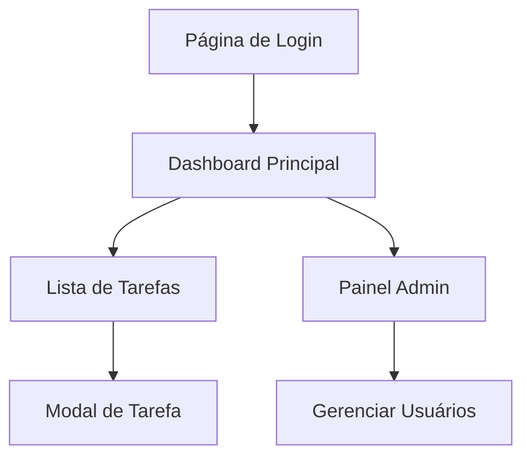

# Modernização do Frontend TaskStream

## 1. Visão Geral do Projeto

O TaskStream é uma aplicação de gerenciamento de tarefas com arquitetura moderna baseada em Vue 3, Vite, Tailwind CSS e Pinia. O objetivo desta modernização é elevar a experiência do usuário mantendo a mesma arquitetura sólida, mas implementando um design system mais sofisticado, melhor responsividade e interações mais fluidas.

## 2. Funcionalidades Principais

### 2.1 Papéis de Usuário

| Papel           | Método de Registro  | Permissões Principais                                                 |
| --------------- | ------------------- | --------------------------------------------------------------------- |
| Usuário Regular | Registro por email  | Gerenciar suas próprias tarefas, visualizar dashboard pessoal         |
| Administrador   | Upgrade via sistema | Acesso ao painel administrativo, gerenciar usuários e tarefas globais |

### 2.2 Módulos de Funcionalidade

Nossa aplicação TaskStream modernizada consistirá nas seguintes páginas principais:

1. **Página de Login/Registro**: formulário moderno com animações, validação em tempo real, modo escuro
2. **Dashboard Principal**: cards estatísticos interativos, gráficos, layout responsivo avançado
3. **Lista de Tarefas**: filtros avançados, busca inteligente, ordenação drag-and-drop
4. **Painel Administrativo**: interface administrativa sofisticada com métricas e controles

### 2.3 Detalhes das Páginas

| Nome da Página   | Nome do Módulo             | Descrição da Funcionalidade                                                                           |
| ---------------- | -------------------------- | ----------------------------------------------------------------------------------------------------- |
| Login/Registro   | Formulário de Autenticação | Interface moderna com validação em tempo real, animações suaves, feedback visual, suporte a dark mode |
| Dashboard        | Cards Estatísticos         | Cards interativos com hover effects, micro-animações, gráficos responsivos, layout grid adaptativo    |
| Dashboard        | Header Responsivo          | Navigation bar moderna com menu hamburger mobile, avatar do usuário, notificações                     |
| Lista de Tarefas | Filtros Avançados          | Sistema de filtros com chips, busca instantânea, filtros salvos, ordenação personalizada              |
| Lista de Tarefas | Cards de Tarefa            | Cards modernos com estados visuais, progress bars, badges de prioridade, ações contextuais            |
| Lista de Tarefas | Modal de Edição            | Modal responsivo com formulário avançado, date picker moderno, validação visual                       |
| Painel Admin     | Métricas e Gráficos        | Dashboard administrativo com charts interativos, tabelas avançadas, exportação de dados               |

## 3. Fluxo Principal de Processos

### Fluxo do Usuário Regular

1. Usuário acessa a página de login com interface moderna
2. Após autenticação, é direcionado ao dashboard com animação de transição
3. Visualiza estatísticas em cards interativos com hover effects
4. Navega para lista de tarefas com filtros avançados
5. Cria/edita tarefas através de modais responsivos
6. Recebe feedback visual em todas as ações

### Fluxo do Administrador

1. Acesso adicional ao painel administrativo
2. Visualização de métricas globais em gráficos interativos
3. Gerenciamento de usuários com interface sofisticada

## 4. Design da Interface do Usuário

### 4.1 Estilo de Design

**Paleta de Cores Moderna:**

* Primária: #3B82F6 (Blue-500) e #1D4ED8 (Blue-700)

* Secundária: #10B981 (Emerald-500) e #059669 (Emerald-600)

* Neutros: #F8FAFC (Slate-50) a #0F172A (Slate-900)

* Acentos: #F59E0B (Amber-500), #EF4444 (Red-500), #8B5CF6 (Violet-500)

**Tipografia:**

* Fonte principal: Inter (já configurada)

* Tamanhos: text-xs (12px) a text-6xl (60px)

* Pesos: font-light (300) a font-black (900)

* Altura de linha otimizada para legibilidade

**Estilo de Componentes:**

* Botões com border-radius de 8px, sombras suaves, estados hover/focus

* Cards com sombra sutil (shadow-sm a shadow-xl)

* Inputs com focus rings coloridos e validação visual

* Layout baseado em CSS Grid e Flexbox responsivo

**Animações e Transições:**

* Transições suaves (transition-all duration-200)

* Hover effects em cards e botões

* Loading states com spinners modernos

* Micro-interações em formulários

### 4.2 Visão Geral do Design das Páginas

| Nome da Página   | Nome do Módulo       | Elementos da UI                                                                                                  |
| ---------------- | -------------------- | ---------------------------------------------------------------------------------------------------------------- |
| Login/Registro   | Formulário Principal | Container centralizado com glassmorphism, inputs com floating labels, botões com gradiente, animações de entrada |
| Dashboard        | Cards Estatísticos   | Grid responsivo 1-2-4 colunas, cards com hover lift effect, ícones coloridos, números animados                   |
| Dashboard        | Header               | Navbar fixa com backdrop blur, logo responsivo, menu dropdown do usuário, breadcrumbs                            |
| Lista de Tarefas | Área de Filtros      | Barra de filtros sticky, chips removíveis, busca com ícone, dropdown customizado                                 |
| Lista de Tarefas | Cards de Tarefa      | Cards com border-left colorido por prioridade, badges modernos, botões de ação com tooltips                      |
| Modal de Tarefa  | Formulário           | Modal com overlay escuro, formulário em steps, date picker customizado, validação em tempo real                  |

### 4.3 Responsividade

**Estratégia Mobile-First:**

* Breakpoints: sm (640px), md (768px), lg (1024px), xl (1280px), 2xl (1536px)

* Layout adaptativo com CSS Grid e Flexbox

* Menu hamburger para navegação mobile

* Cards empilháveis em telas pequenas

* Touch-friendly com áreas de toque de 44px mínimo

* Otimização para gestos touch (swipe, pinch, tap)

**Acessibilidade:**

* Contraste WCAG AA compliant

* Navegação por teclado completa

* Screen reader friendly

* Focus indicators visíveis

* Textos alternativos em ícones

* Suporte a modo de alto contraste

