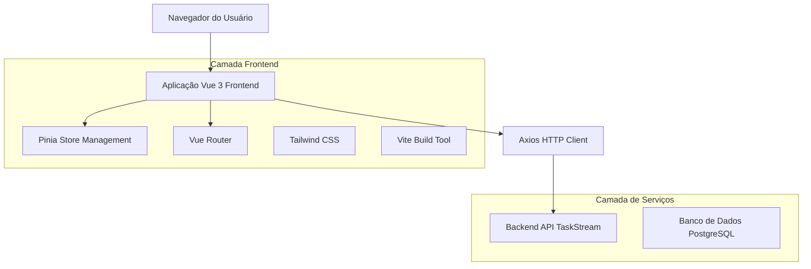
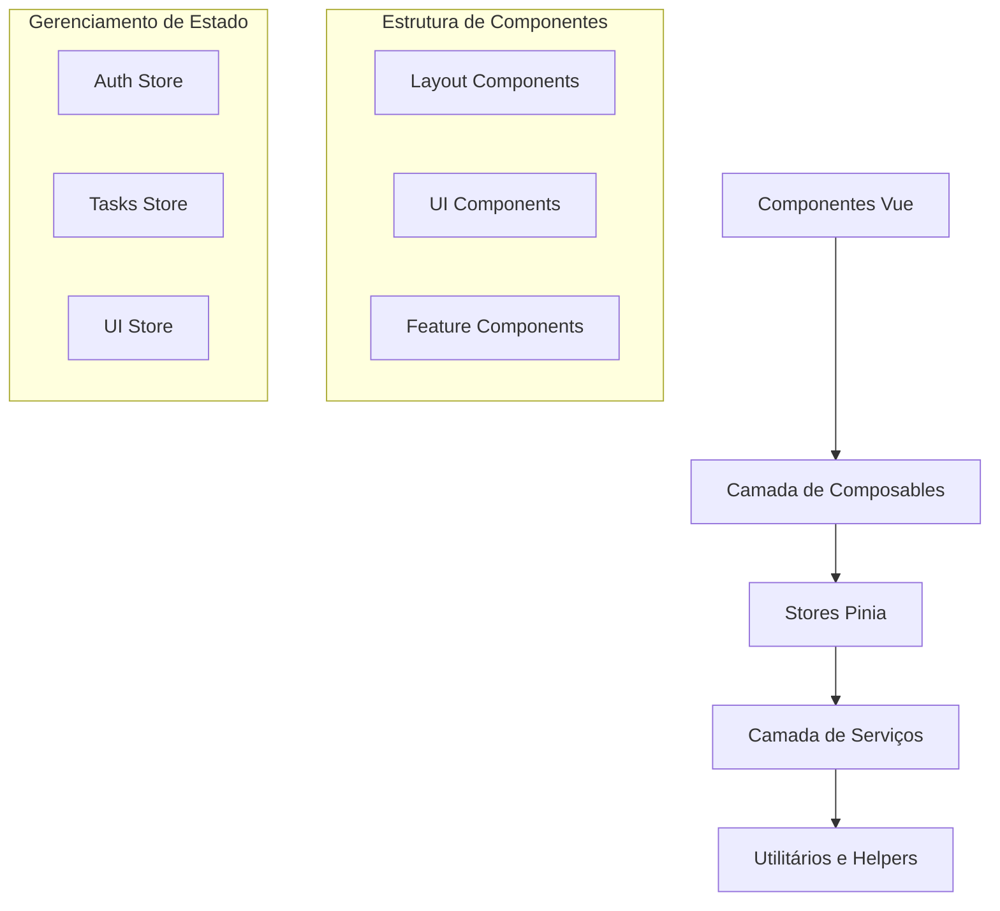
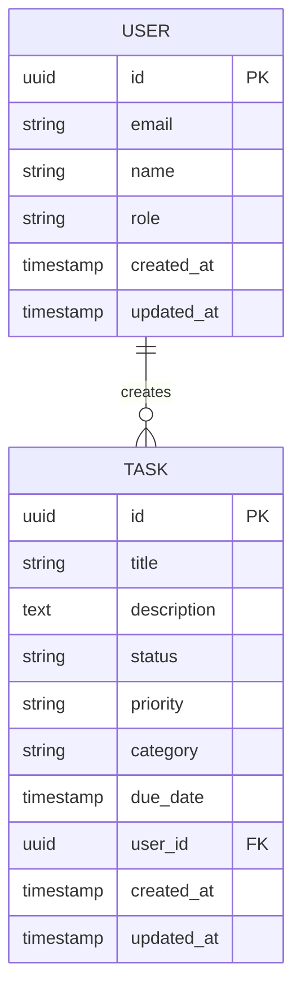

# Arquitetura Técnica - Modernização Frontend TaskStream

## 1. Arquitetura de Design



## 2. Descrição das Tecnologias

**Frontend Modernizado:**

* Vue 3.5.18 + Composition API + TypeScript (opcional)

* Tailwind CSS 3.4.17 + Custom Design System

* Vite 7.0.6 + Hot Module Replacement

* Pinia 3.0.3 para gerenciamento de estado

* Vue Router 4.5.1 para navegação

* Axios 1.11.0 para requisições HTTP

**Ferramentas de Desenvolvimento:**

* Vite Plugin Vue DevTools 8.0.0

* PostCSS + Autoprefixer

* ESLint + Prettier (recomendado)

* Vitest para testes (recomendado)

**Bibliotecas Adicionais Recomendadas:**

* @headlessui/vue para componentes acessíveis

* @heroicons/vue para ícones consistentes

* framer-motion ou @vueuse/motion para animações

* chart.js ou recharts para gráficos

* date-fns para manipulação de datas

## 3. Definições de Rotas

| Rota       | Propósito                                                |
| ---------- | -------------------------------------------------------- |
| /          | Página inicial, redireciona para /login ou /dashboard    |
| /login     | Página de autenticação moderna com formulário responsivo |
| /dashboard | Dashboard principal com cards estatísticos e navegação   |
| /tasks     | Lista completa de tarefas com filtros avançados          |
| /admin     | Painel administrativo (apenas para admins)               |
| /profile   | Página de perfil do usuário (futura implementação)       |
| /settings  | Configurações da aplicação incluindo dark mode           |

## 4. Definições de API

### 4.1 APIs Principais

**Autenticação de usuário**

```
POST /api/auth/login
```

Request:

| Nome do Parâmetro | Tipo   | Obrigatório | Descrição        |
| ----------------- | ------ | ----------- | ---------------- |
| email             | string | true        | Email do usuário |
| password          | string | true        | Senha do usuário |

Response:

| Nome do Parâmetro | Tipo    | Descrição                   |
| ----------------- | ------- | --------------------------- |
| success           | boolean | Status da resposta          |
| token             | string  | JWT token para autenticação |
| user              | object  | Dados do usuário            |

Exemplo:

```json
{
  "email": "usuario@exemplo.com",
  "password": "senha123"
}
```

**Gerenciamento de Tarefas**

```
GET /api/tasks
POST /api/tasks
PUT /api/tasks/:id
DELETE /api/tasks/:id
```

**Estatísticas do Dashboard**

```
GET /api/dashboard/stats
```

Response:

| Nome do Parâmetro | Tipo   | Descrição            |
| ----------------- | ------ | -------------------- |
| total             | number | Total de tarefas     |
| pending           | number | Tarefas pendentes    |
| inProgress        | number | Tarefas em andamento |
| completed         | number | Tarefas concluídas   |
| overdue           | number | Tarefas atrasadas    |

## 5. Arquitetura do Servidor Frontend



## 6. Modelo de Dados

### 6.1 Definição do Modelo de Dados



### 6.2 Estrutura de Dados Frontend

**Interface de Usuário (TypeScript)**

```typescript
interface User {
  id: string
  email: string
  name: string
  role: 'user' | 'admin'
  createdAt: string
  updatedAt: string
}

interface Task {
  id: string
  title: string
  description: string
  status: 'pending' | 'in_progress' | 'completed'
  priority: 'low' | 'medium' | 'high'
  category: string
  dueDate?: string
  userId: string
  createdAt: string
  updatedAt: string
  // Computed properties
  isOverdue?: boolean
  statusEmoji?: string
  priorityEmoji?: string
}

interface DashboardStats {
  total: number
  pending: number
  inProgress: number
  completed: number
  overdue: number
}
```

**Store State Interfaces**

```typescript
interface AuthState {
  user: User | null
  token: string | null
  loading: boolean
  error: string | null
}

interface TasksState {
  tasks: Task[]
  stats: DashboardStats
  loading: boolean
  error: string | null
  filters: {
    search: string
    status: string
    priority: string
    category: string
  }
}

interface UIState {
  darkMode: boolean
  sidebarOpen: boolean
  notifications: Notification[]
  theme: 'light' | 'dark' | 'system'
}
```

## 7. Estrutura de Componentes Modernizada

### 7.1 Organização de Arquivos

```
src/
├── components/
│   ├── ui/              # Componentes base do design system
│   │   ├── Button.vue
│   │   ├── Card.vue
│   │   ├── Input.vue
│   │   ├── Modal.vue
│   │   └── Badge.vue
│   ├── layout/          # Componentes de layout
│   │   ├── AppHeader.vue
│   │   ├── AppSidebar.vue
│   │   └── AppFooter.vue
│   └── features/        # Componentes específicos de funcionalidades
│       ├── TaskCard.vue
│       ├── TaskList.vue
│       ├── TaskModal.vue
│       └── StatsCard.vue
├── composables/         # Lógica reutilizável
│   ├── useAuth.js
│   ├── useTasks.js
│   ├── useTheme.js
│   └── useLocalStorage.js
├── stores/              # Gerenciamento de estado Pinia
├── services/            # Camada de serviços API
├── utils/               # Utilitários e helpers
├── assets/              # Recursos estáticos
└── styles/              # Estilos globais e customizações Tailwind
```

### 7.2 Design System Components

**Componentes Base:**

* Button: Variantes (primary, secondary, ghost, danger)

* Card: Container base com sombras e bordas

* Input: Campos de entrada com validação visual

* Modal: Overlay responsivo com animações

* Badge: Indicadores de status e categorias

* Loading: Estados de carregamento consistentes

**Componentes de Layout:**

* AppHeader: Navegação responsiva com menu mobile

* AppSidebar: Navegação lateral (desktop)

* AppFooter: Rodapé com informações

**Componentes de Funcionalidade:**

* TaskCard: Card moderno para exibição de tarefas

* TaskList: Lista com filtros e paginação

* TaskModal: Modal para criação/edição

* StatsCard: Cards estatísticos animados

## 8. Configuração de Desenvolvimento

### 8.1 Tailwind CSS Customizado

```javascript
// tailwind.config.js
export default {
  content: ['./index.html', './src/**/*.{vue,js,ts,jsx,tsx}'],
  darkMode: 'class',
  theme: {
    extend: {
      colors: {
        primary: {
          50: '#eff6ff',
          500: '#3b82f6',
          600: '#2563eb',
          700: '#1d4ed8',
          900: '#1e3a8a'
        }
      },
      fontFamily: {
        sans: ['Inter', 'system-ui', 'sans-serif']
      },
      animation: {
        'fade-in': 'fadeIn 0.5s ease-in-out',
        'slide-up': 'slideUp 0.3s ease-out'
      }
    }
  },
  plugins: [
    require('@tailwindcss/forms'),
    require('@tailwindcss/typography')
  ]
}
```

### 8.2 Vite Configuration

```javascript
// vite.config.js
export default defineConfig({
  plugins: [
    vue(),
    vueDevTools()
  ],
  resolve: {
    alias: {
      '@': fileURLToPath(new URL('./src', import.meta.url))
    }
  },
  css: {
    postcss: {
      plugins: [
        require('tailwindcss'),
        require('autoprefixer')
      ]
    }
  }
})
```

